# Moodboards Site

## Table of Contents

* [User Experience Design (UX)](#user-experience-design)
    * [The Strategy Plane](#the-strategy-plane)
        * [Site Goals](#site-goals)
        * [Agile Planning](#agile-planning)
          * [Project Epics](#project-epics)
          * [User Stories](#user-stories)
    * [The Scope Plane](#the-scope-plane)
    * [The Structure Plane](#the-structure-plane)
      * [Features](#features)
    * [The Skeleton Plane](#the-skeleton-plane)
        * [Wireframes](#wireframes)
        * [Database Design](#database-design)
        * [Security](#security)
    * [The Surface Plane](#the-surface-plane)
        * [Design](#design)
            * [Colour Scheme](#colour-scheme)
            * [Typography](#typography)
            * [Imagery](#imagery)
* [Technologies](#technologies)
* [Testing](#testing)
* [Deployment](#deployment)
    * [Version Control](#version-control)
    * [Heroku Deployment](#heroku-deployment)
    * [Run Locally](#run-locally)
    * [Fork Project](#forkin-the-project)
* [Credits/References](#credits/references)

# User Experience Design

## The Strategy Plane

### Site Goals
This web app is designed to allow users to quickly and easily create and save image based 'Moodboards', which can be used for a variety of reasons such as having inspiration or references when working on a creative piece. It must be user friendly to use, whilst providing all essential functions such as creating, deleting and editing a moodboard, as well as browsing other user submitted boards on the site.

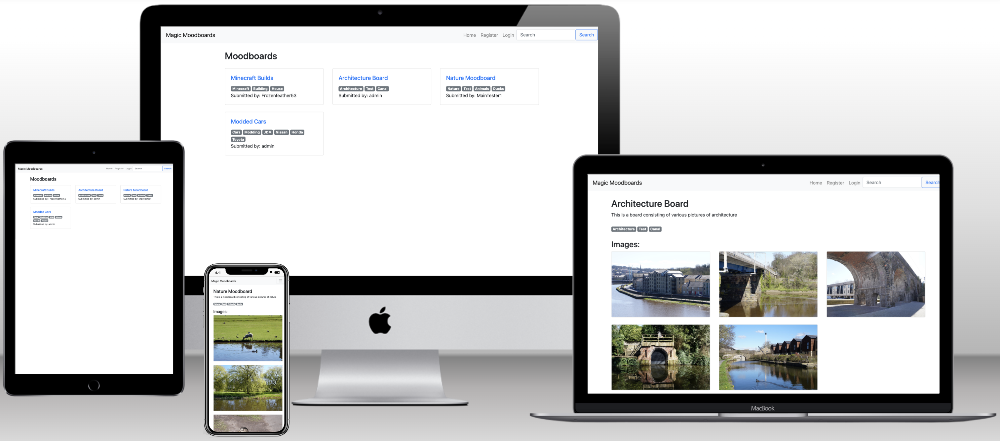

A live version of the site can be found [here](https://ci-project-4-django-moodboards.herokuapp.com/)

### Agile Planning
Aiding in the development of the project, agile methodologies were utilised, delivering small features in incremental sprints over a period of four weeks, with a total of three sprints. To prioritize tasks, I assigned them to epics and labeled them as "Must have," "Should have," or "Could have." Tasks were then story-pointed based on their complexity, with "Must have" stories taking precedence and completed first, followed by "Should haves," and finally "Could haves." This approach ensured that all core requirements were met before adding any additional features.

To monitor progress, a Kanban board was made by using Github Projects. You can access the board for more information on the project cards. All stories, except documentation tasks, have a full set of acceptance criteria that define the functionality necessary to mark a story as complete.
#### Project EPICs

**Setup**

The Setup epic focuses on setting up the foundational aspects of the application, such as configuring the development environment, integrating necessary libraries, and creating the initial project structure. This epic lays the groundwork for the entire application, ensuring all the other epics can be built upon a stable and well-configured base.

**Static/Standalone pages**

The Static/Standalone pages epic encompasses the creation and design of smaller, independent pages that are not directly related to the core functionalities but contribute to the overall user experience. These pages include the 404, 403 and 500 error pages which improve the user experience of the site if any of these errors are encountered by allowing the user to easily navigate home.

**Authentication**

The Authentication epic is responsible for implementing the user registration, login, and authorization features for the site. It ensures that users can securely create accounts, log in, and interact with protected views or features. This epic is crucial for enabling role-based access to certain functionalities, such as creating moodboards.

**Moodboards**

The Moodboards epic covers all stories related to creating, viewing, updating, and deleting moodboards. It enables users to manage their moodboards and interact with them through an intuitive user interface. This epic is central to the core functionality of the site, allowing users to fully engage with the moodboard creation and management process.

**Browsing/searching Moodboards**

The Browsing/searching Moodboards epic focuses on providing a seamless experience for users to browse and search for moodboards on the site. It includes the implementation of search functionality, filters, and sorting options, enabling users to find moodboards based on their preferences and interests quickly and efficiently.

**Deployment**

The Deployment epic handles all tasks related to deploying the application to a hosting platform, such as Heroku, so that it is accessible to users. This epic ensures that the site is live, functional, and available for users to access and interact with from various devices and locations.

**Documentation**

The Documentation epic covers all tasks associated with creating and maintaining documentation for the application. This includes documenting the software development lifecycle, providing detailed information on setup, deployment, and usage, and outlining any necessary troubleshooting or maintenance procedures. This epic aims to deliver comprehensive and accessible documentation, helping users, and developers better understand and interact with the application.

#### User Stories

The following user stories were completed for each epic across the 3 sprints:

**Setup**

As a **developer** I must **set up and configure the project** so that **initial development and implementation of core features can begin**

As a **developer** I must **create the static images, CSS and JS resources** so that **they can be used and accessed across the website.**
***As a developer***

As a **developer** I must **create a responsive navbar** so that **it can be included in the base.html file for easy navigation on the site on a range of devices**

As a **developer** I must **create the base.html page and structure ** so that **it can be included in most other pages on the site**
**Static/Standalone pages**

**Authentication**

As a **developer** I must **implement Allauth authentication** so that **users can login and sign up to the site**

**Moodboards**

As a **user** I want to be able to **create new mood boards** so that **I can use them for inspiration in projects**

As a **user** I would like to **be able to edit moodboard** so that **they can be modified or expanded on after creation, rather than creating a brand new one**
**Browsing/searching Moodboards**

As a **user** I would like to **be able to delete a moodboard I have created** in order to **remove moodboard that are no longer required or for completed projects**

As a **user** I would like to **view published moodboard** so that **they can be used for inspiration for projects**

**Deployment**

As a **developer** I must **deploy the project to Heroku** so that **it is live and accessible to users**

**Documentation**
Tasks:
- Finish README documentation writeup
- Finish testing documentation writeup
- 
## The Scope Plane

- Simple, user friendly interface throughout the site
- Responsive website design on various screen widths
- CRUD functionality on moodboards
- User based restrictions on features such as creating, editing and deleting moodboards

## The Structure Plane

### Features

**Navbar**

User Story: 

As a **developer** I must **create a responsive navbar** so that **it can be included in the base.html file for easy navigation on the site on a range of devices**

The Navbar is a consistent navigation element present on all pages of the website. It allows users to easily navigate between different sections of the site. It contains links to the Home Page, Create Moodboard Page, Register Page, Login Page, and Logout Button. The Navbar is responsive and collapses into a hamburger menu on smaller devices, ensuring an optimal user experience on various screen sizes.

**Home Page**

User Story:

As a **site owner** I would like **a home page which displays user submitted moodboards** so that **users can instantly see examples of other user's submissions when visiting the site**

The Home Page serves as the main landing page for the website. It displays a collection of moodboards created by users, along with a search functionality to find moodboards based on keywords. The page is accessible to all users, both logged in and logged out.

**Create Moodboard Page**

User Story:

As a **user** I want to be able to **create new mood boards** so that **I can use them for inspiration in projects**

The Create Moodboard Page is accessible to authenticated users, allowing them to create new moodboards. This page contains a form where users can enter the moodboard's title, description, and tags, as well as upload multiple images. Once the form is submitted, the moodboard is saved, and the user is redirected to the Home Page.

**Edit Moodboard Page**

User Story:

As a **user** I would like to **be able to edit moodboard** so that **they can be modified or expanded on after creation, rather than creating a brand new one**

The Edit Moodboard Page allows users to modify their existing moodboards. This page is accessible only to the moodboard's creator or staff members. Users can update the moodboard's title, description, tags, and images. After making changes, the user can submit the form, and the moodboard will be updated accordingly.

**Moodboard Detail Page**

User Story:

As a **user** I would like to **view published moodboard** so that **they can be used for inspiration for projects**

The Moodboard Detail Page is accessible to all users and displays the full information of a specific moodboard. It showcases the its title, description, tags, and a collection of images associated with the moodboard. For the moodboard's creator or staff members, additional options such as Edit Moodboard and Delete Moodboard Button are available on this page. This page provides users with an in-depth view of a moodboard, allowing them to explore its content and interact with it accordingly.

An image modal has been implemented on this page so that the user can click to expand each image for a better viewing experience.

**Delete Moodboard Button**

User Story:

As a **user** I would like to **be able to delete a moodboard I have created** in order to **remove moodboards that are no longer required or for completed projects**

The Delete Moodboard Button is available on the moodboard detail page and allows users to remove a moodboard from the website. This action is restricted to the moodboard's creator or staff members. Once the moodboard is deleted, a confirmation message is displayed, and the user is redirected to the Home Page.

**Register Page**

User Story:

As a **user** I can **register a new account** so that **I am able to use this to log in to the site**

The Register Page is accessible to logged-out users, allowing them to create a new account on the website. This page contains a registration form where users can enter their email address, username, and password. After successful registration, users are redirected to the Home Page.

**Login Page**

User Story:

As a **user** I can **log in to an existing account** so that **I can interact with secured parts of the site, such as submitting a moodboard**

The Login Page is accessible to logged-out users, allowing them to authenticate themselves and access protected areas of the website. This page contains a login form where users can enter their email address or username and password. After successful authentication, users are redirected to the Home Page.

**Logout Button**

User Story:

As a **user** I can **log out of my account** so that **I can change the account I am logged into or maintain the security of my account on a shared device**

The Logout Button is available in the Navbar and is visible only to logged-in users. When clicked, after a confirmation it logs the user out of their account and redirects them to the Home Page.

**404 Page**

User Story:

As a **developer** I must **create a 404 page** in order to **alert users when they have attempted to access an invalid page**

**403 Page**

User Story:

As a **developer** I must **create a 403 error page** so that **I can redirect users in order to secure views**

**500 Page**

User Story:

As a **developer** I must **create a 500 error page** so that **users can be notified when an internal server error occurs**

## The Skeleton Plane

### Wireframes

**Index**

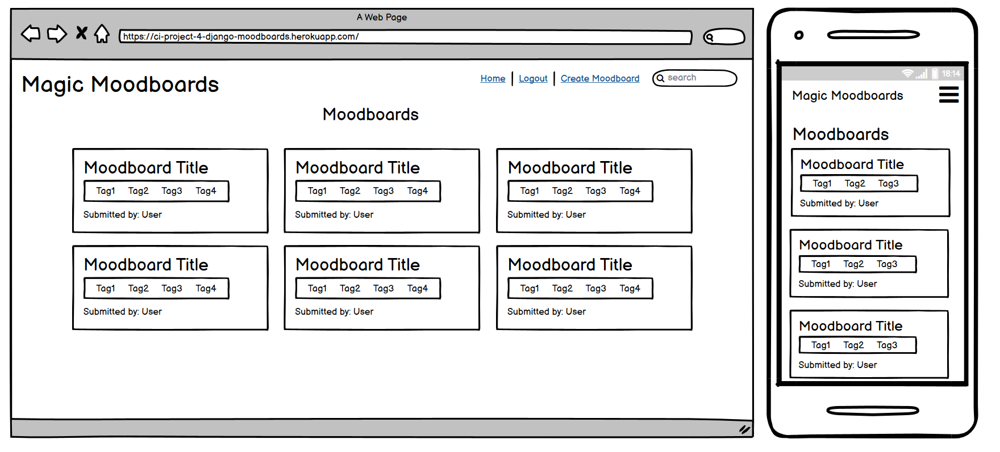

**Create**

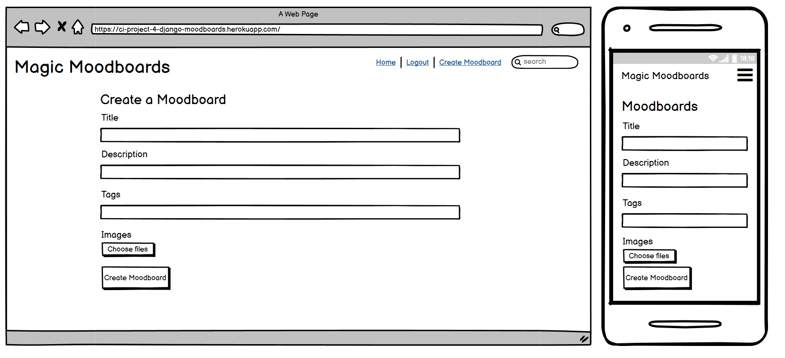

**Edit**

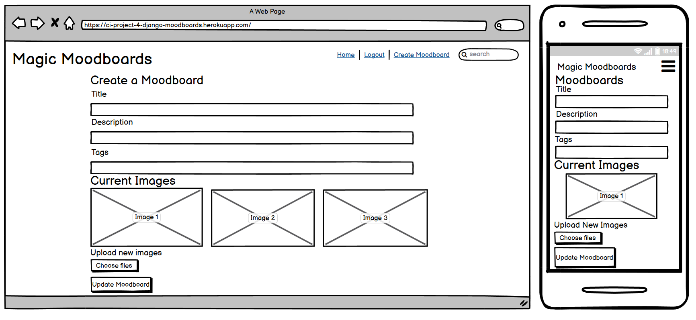

**Detail**

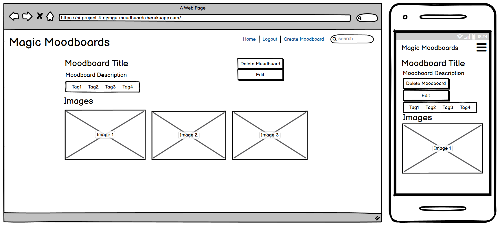

**Login**

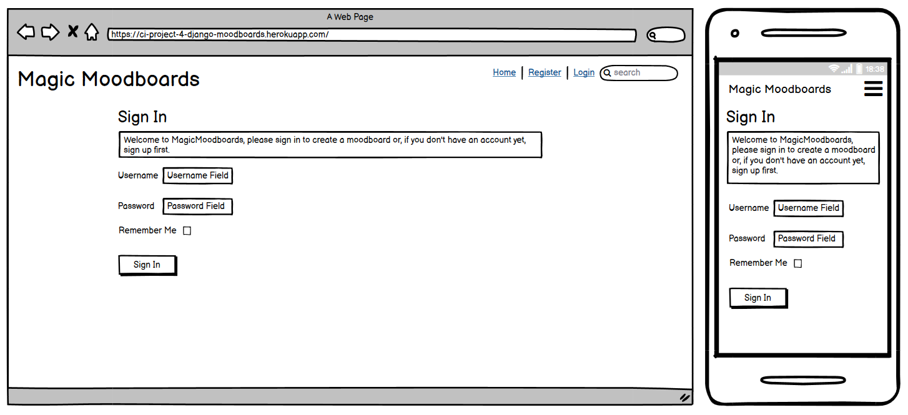

**Logout**

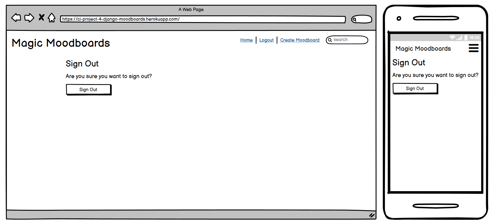

**Register**

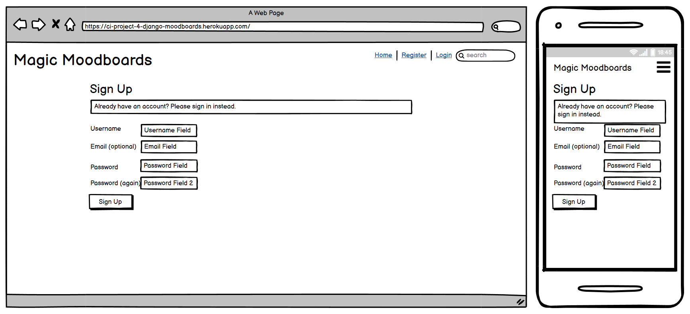

**404**

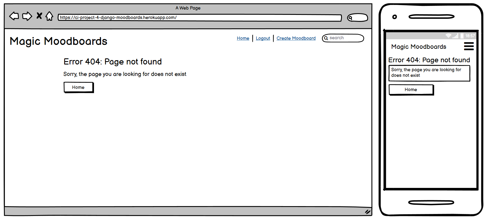

**403**

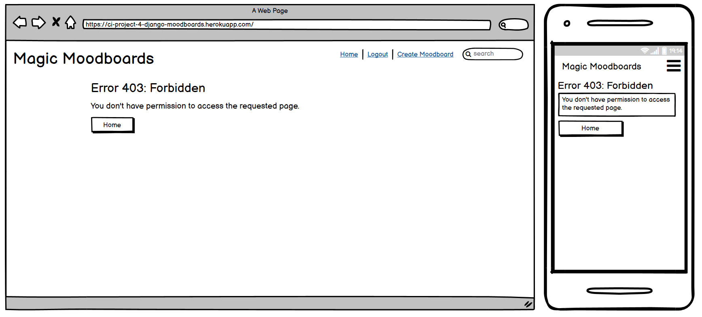

**500**

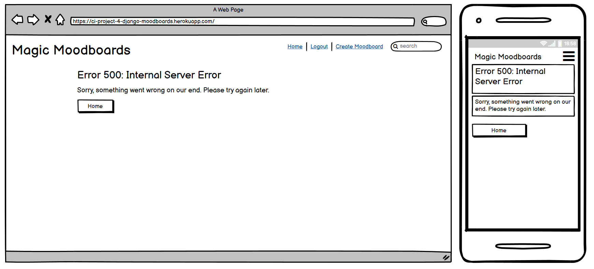

### Database Design

The database design for this project primarily consists of two main entities: Moodboard and Image. These entities are represented by Django models which are used to create the corresponding database tables. Below is an explanation of these entities and their relationships.

**Moodboard**

The Moodboard entity represents a moodboard created by a user. It has the following fields:

1.  `title`: A CharField representing the title of the moodboard with a maximum length of 200 characters.
2.  `description`: A TextField that stores an optional description for the moodboard.
3.  `user`: A ForeignKey field that links the moodboard to the User model from Django's built-in authentication system, representing the creator of the moodboard. It uses `CASCADE` for the `on_delete` argument, which means if a user is deleted, all their associated moodboards will be deleted as well.
4.  `tags`: A CharField that holds a comma-separated list of tags associated with the moodboard. It has a maximum length of 500 characters and is optional.

**Image**

The Image entity represents an image associated with a moodboard. It has the following fields:

1.  `image`: An ImageField that stores the image file. Images are uploaded to a designated folder named "moodboard_images".
2.  `moodboard`: A ForeignKey field that links the image to a Moodboard model. It uses `CASCADE` for the `on_delete` argument, meaning if a moodboard is deleted, all its associated images will also be deleted.

**Relationships**

The Moodboard and Image entities have a one-to-many relationship, where one moodboard can have multiple associated images. This relationship is represented by the ForeignKey field in the Image model, which connects each image to a single moodboard.

The Moodboard and User entities also have a one-to-many relationship, where one user can create multiple moodboards. This relationship is represented by the ForeignKey field in the Moodboard model, which connects each moodboard to a single user.

### Security

In this project, various security features have been implemented to ensure user privacy and data protection. The following is an explanation of these security measures:

1. **User Authentication and Authorization**: The project uses Django's built-in authentication system, which provides a secure and robust way to manage user authentication. This includes features like password hashing, password reset functionality, and login/logout mechanisms. Additionally, the project incorporates role-based access control, where certain views and actions are restricted to specific user groups (such as staff members) or authenticated users only.

2. **CSRF Protection**: Django includes built-in protection against Cross-Site Request Forgery (CSRF) attacks. By default, CSRF middleware generates a unique token for each user session and includes it in forms as a hidden field. This token is then validated on the server-side upon form submission to ensure that the request originates from the same site.

3. **SQL Injection Prevention**: Django's Object-Relational Mapping (ORM) system automatically sanitizes query inputs, effectively preventing SQL injection attacks. By using Django's ORM for database operations, the project ensures that user input is escaped and properly validated before being included in SQL queries.

4. **Secure File Uploads**: The project uses Cloudinary for handling file uploads, which provides a secure and scalable solution for storing and serving images. By relying on a trusted third-party service, the project minimizes the potential security risks associated with file uploads.

5. **Secure Configuration**: The project stores sensitive configuration variables, such as secret keys, database credentials, and API keys, in environment variables or Heroku config vars. This ensures that sensitive data is not hardcoded into the source code and can be easily managed and protected.

6. **HTTPS**: It is recommended to enforce HTTPS for the deployed application, ensuring that all data transmitted between the user's browser and the server is encrypted. This protects sensitive data, such as login credentials and personal information, from being intercepted by malicious parties.

By implementing these security features, the project aims to provide a safe and secure experience for users while minimizing the potential for data breaches or unauthorized access to sensitive information.

## The Surface Plane

### Design 

This site uses a simple design and colour scheme, with the main focus being on accessibility, such as through ensuring high contrast between all text and elements.

## Technologies

In this project, various technologies have been utilized to create a functional and visually appealing website. Below is a list of the technologies used and a brief explanation of their roles:

1. **HTML**: HTML is used as the primary language for creating the structure and layout of the website, organizing content into elements such as headings, paragraphs, lists, and tables.

2. **CSS**: Custom CSS is used to style the website, enhancing its visual appeal and ensuring consistency in the design. This includes elements such as colors, fonts, and layout adjustments.

3. **JavaScript**: JavaScript is employed for adding interactivity and dynamic content to the website, such as on the moodboard details page for the larger modal view for images..

4. **Python**: Python serves as the main programming language for the application, leveraging the Django web framework to facilitate the development of server-side functionality.

5. **Visual Studio Code**: This IDE is used for coding and managing the project, offering a wide range of features to improve the development workflow.

6. **Gitpod**: A cloud-based IDE enabling developers to work on projects from anywhere using a browser. Visual Studio Code was ran within this environment throughout the project's development.

7. **GitHub**: GitHub hosts the project's source code, providing version control and facilitating collaboration among team members, as well as project management through the use of 'Issues' and the 'Kanban Board' which are built in to GitHub.

8. **Git**: Git is used for managing the source code during the development process, allowing for the tracking of changes, branching, and merging.

9. **Balsamiq**: Balsamiq is utilized to create wireframes for the website, allowing for the visualization and planning of the site's layout and user interactions before development begins.

**Python Modules Used**

-   Django Class based views (ListView, UpdateView, DeleteView, CreateView) - Used for the classes to create, read, update and delete
-   Mixins (LoginRequiredMixin, UserPassesTestMixin) - Used for authentication and security throughout the site
-   Messages - Used for sending status messages to the user, such as when an action is successful

**External Python Modules**

- **asgiref==3.6.0**: ASGI server implementation, used for asynchronous handling of requests in Django.
- **cloudinary==1.32.0**: Cloudinary API integration, used for image management and storage.
- **dj-database-url==0.5.0**: Database configuration helper, simplifies connecting Django to different databases.
- **dj3-cloudinary-storage==0.0.6**: Django storage backend for Cloudinary, enables seamless integration.
- **Django==3.2.18**: The main web framework used to build the project.
- **django-allauth==0.54.0**: Authentication app, provides user registration, login, and social authentication.
- **gunicorn==20.1.0**: WSGI HTTP server, used for running the Django application on production.
- **oauthlib==3.2.2**: OAuth library, enables secure user authentication for social login.
- **Pillow==9.5.0**: Python Imaging Library, supports image processing and manipulation.
- **psycopg2==2.9.6**: PostgreSQL adapter for Python, connects Django to PostgreSQL database.
- **PyJWT==2.6.0**: JSON Web Token implementation, used for secure communication between services.
- **python3-openid==3.2.0**: OpenID support for Django, enables social authentication.
- **pytz==2023.3**: Timezone library for Python, used to handle timezone-aware datetimes in Django.
- **requests-oauthlib==1.3.1**: OAuth library for Requests, simplifies implementing OAuth in Python.
- **sqlparse==0.4.3**: SQL parsing library, assists with formatting and validating SQL statements.
- **whitenoise==6.4.0**: Static file serving for Django applications, simplifies serving static assets in production.

## Testing

## Deployment

### Version Control

### Heroku Deployment

### Run Locally

### Forking the Project

## Credits/References 

